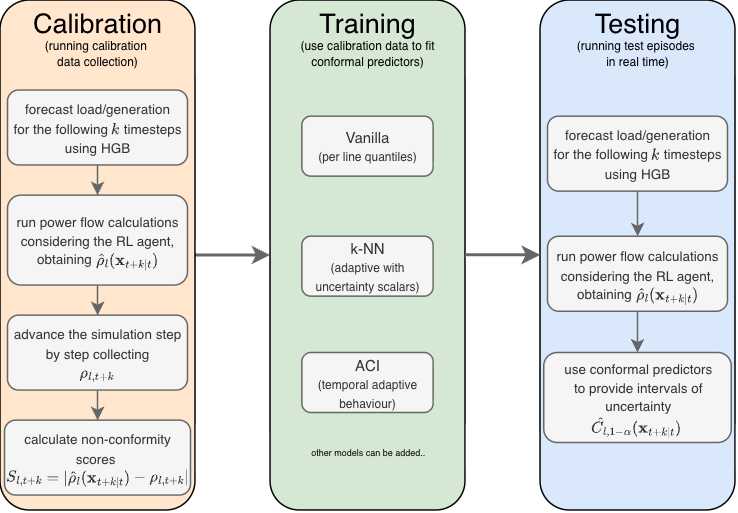

# Conformal Prediction Framework for Power Grid Safety

A framework for using CP (Conformal Prediction) models to provide intervals of uncertainty around point
forecasts in Grid2Op.

Adittionally provides the implementation of a STL (Signal Temporal Logic) rule. See [STL README](./stl_rules/README.md).

## Overview

For the framework to work, it requires a pre-trained load/generation forecaster model, and a Grid2Op trained agent.



It runs simulations on a Grid2Op power grid environment, which consist of three main phases:

- **Calibration:** Collects calibration dataset
  - Runs $n_{cal}$ episodes, collecting the forecasted and actual values of $\hat \rho$ and $\rho$.
- **Training:** "Trains" CP implementations / STL verifier
  - Uses the data obtained during the calibration phase to fit the Conformal Models
- **Testing:** Use the models in real time
  - Runs $n_{test}$ episodes, providing intervals of uncertainty around the point forecasts.

And a fourth phase:

- Analysis: Evaluates the performance
  - Export metrics to csv files (and generate plots)

## Using a Different Forecaster/agent/environment

### Using a Different Forecaster

The framework supports multiple forecaster implementations. To use a different forecaster:

1. **Create a new forecaster class** in the `forecasters/` directory (e.g., `forecasters/my_forecaster.py`)

2. **Inherit from the base `Forecaster` class** and implement the `perform_forecast()` method:

```python
import datetime
import joblib
from grid2op.Agent import BaseAgent
from grid2op.Observation import BaseObservation

from forecast import Forecaster
from utils.data_structures import SimpleObservation


class MyForecaster(Forecaster):
    def __init__(self, model_path: str, **kwargs):
        # to initiatte the model
        # here joblib.load as an example
        model = joblib.load(model_path)
        super().__init__(model, **kwargs)

    def perform_forecast(
        self,
        obs: BaseObservation,
        observations_array: list[SimpleObservation],
        agent: BaseAgent,
        **kwargs,
    ) -> tuple[
        dict[datetime.datetime, list[float]],
        set[datetime.datetime],
        dict[datetime.datetime, SimpleObservation],
    ]:
        """
        Forecasting logic here
        
        To respect the interface, it has to return:
            - agent_forecast_dict: dictionary mapping datetime to forecasted rho values
            - forecast_timestamps: set of timestamps for this forecast
            - obs_dict: dictionary mapping datetime to SimpleObservation objects
        """
        pass
```

3. **Update `config.py`** to use the "new" forecaster:

```python
FORECASTER_MODULE = "forecasters.my_forecaster"
FORECASTER_CLASS = "MyForecaster"
FORECASTER_PATH = "../path/to/your/model.pkl"
```

See [forecasters/hbgb_14.py](./forecasters/hbgb_14.py) or [forecasters/hbgb_36.py](./forecasters/hbgb_36.py) for reference

### Using a Different Agent/Environment

- The agent path must be changed (check `config.MODEL_PATH`)
- The environment name must be changed (check `config.ENV_NAME`)
- See `create_environment()` function if the agent needs to be loaded differently

## Usage

Configuration is done through `config.py`. The main parameters are:

- `ALPHA` - significance level(s) for conformal prediction (can be a list for multi-alpha runs - runs the simulation once for each alpha in the list)

- `ENSEMBLE_MODE` - whether to train one model per line (ensemble) or a single model

- `CALIB_EPISODES` / `TEST_EPISODES` - number of calibration and test episodes. This assumes `BASE_CHRONIC` is set (important).

- `STEPS_TO_RUN` - maximum number of steps to run in each calibration/test episode

- `IGNORE_CACHE_CALIBRATION` - Allows to ignore calibration episodes, overwriting them with new data.

- `IGNORE_CACHE_MODELS` - Allows to ignore trained models (if they exists in the conditions) and overwritting them once a new training finishes.

- `MODELS` - which conformal models to enable

- `STL_RULE` - which implementation to enable for the provided STL rule

- `HORIZON` - forecast horizon (number of timesteps ahead)

- `CALIBRATION_LINES_ATTACKED` - adversarial attack configuration during calibration (not used for ensemble mode)

- `TESTING_LINES_ATTACKED` - adversarial attack configuration during testing

- `MAX_WORKERS_*` - parallelization settings for calibration, training, and testing

- `RHO_SAFETY_THRESHOLD` - the rho value above which a line is considered unsafe

- `FORECASTER_MODULE` - module path of the forecaster class (e.g., `"forecasters.hbgb_14"`)

- `FORECASTER_CLASS` - name of the forecaster class (e.g., `"HBGB_14"`)

- `FORECASTER_PATH` - path to the trained forecaster model file

Results are saved to `OUTPUT_DIR`, and plots are automatically generated if `AUTO_GEN_PLOTS` is enabled.
If `AUTO_GEN_PLOTS` is disabled, the plots can still be generated. Check `plotting/` folder.

There are more paramenters in this file, that must be changed in order to change the simulation.

When configuration is chosen, we save it and run the following command:

```bash
python main.py
```

## Modules

### `main.py`

Entry point that starts the whole process. Supports running multiple alpha values sequentially and triggers plot generation at the end, if `config.AUTO_GEN_PLOTS = True`

### `forecast.py`

Defines the base `Forecaster` abstract class that all forecaster implementations must inherit from
See [forecasters folder](./forecasters/) folder.

### `calibration.py`

Runs calibration episodes to collect trajectory data for training. Two modes:

- **Single mode** - one model trained on specified attacked lines (or no attacks)
- **Ensemble mode** - one model per power line, each trained with attacks on that specific line

Calibration data is cached to avoid recomputation since results with the same parameters
are deterministic

### `training.py`

Trains conformal prediction models and STL verifiers using calibration data.

- `prepare_calibration_data()` - transforms trajectory data into feature arrays
- `extract_system_state_features()` - extracts features from observations (calendar, rho statistics, generation/load, etc.)
- `extract_trajectory_features()` - extracts features from a trajectory (currently used by the STL rules)
- `run_model_training()` - trains all enabled models, loading from cache when available
- `run_stl_training()` - trains all enabled STL rules (still does not load from cache, TODO)

### `testing.py`

Runs test episodes with real-time conformal prediction / stl_verification. During each episode:

- The agent acts on the environment
- Forecasts are generated when needed (periodically or after agent actions)
- Conformal models produce prediction intervals
- STL rules evaluate trajectory safety

The results of each `Trajectory` are "saved" in a `TrajectoryManager` (which holds the complete episode data)

### `analysis.py`

Computes metrics and exports results to csv files.

- `ConformalMetrics` - calculates coverage, width, and action coverage per model and line
- `ClassificationAnalyser` - computes TP/TN/FP/FN for both conformal and STL classification
- `DataExporter` - writes config, comparison metrics, timeseries, and horizon data to csv

Also does aggregation across multiple episodes.

### `plotting_script.py`

Entry point for plot generation. Can be run standalone or called from `main.py`. Automatically detects the directory structure and generates appropriate plots.

```sh
python plotting_script.py <RESULTS_DIR> <OUTPUT_DIR>

#or

python plotting_script.py <RESULTS_DIR> # saves to the same RESULTS_DIR directory
```

This script can be used in the complete generated folder, or in subfolders like particular alphas
or particular episodes.

See the [plotting folder](./plotting/) `README.md` for details on the plotting modules.

## Output Structure

Results are organized by alpha value:

```sh
RESULTS/
├── alpha_0.1/
│   ├── aggregated_csvs/       # Aggregated metrics for the episodes (csv)
│   ├── aggregated_plots/      # Aggregated plots
│   ├── episode_1/
│   │   ├── csvs/              # csv per episode
│   │   └── plots/             # plots per episode
│   └── episode_2/
│       └── ...
├── alpha_0.2/
│   └── ...
└── multi_alpha_plots.pdf      # Classification plots for multi-alpha

21 directories, 38 files
```
